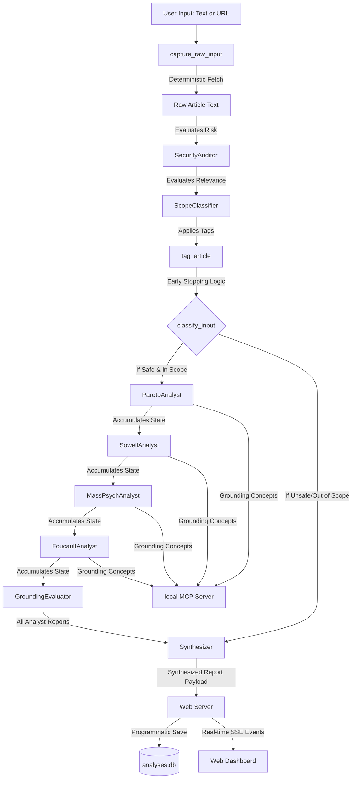

# 🏛️ Political Discourse Analyzer

An advanced multi-agent system built using the **Google ADK (Agent Development Kit)** and the **Model Context Protocol (MCP)**. This system analyzes political text, articles, or speeches from multiple classical sociological and philosophical lenses: Vilfredo Pareto, Thomas Sowell, Carl Schmitt, Gustave Le Bon, Eric Hoffer, René Girard, and Michel Foucault. 

It synthesizes these viewpoints into a cohesive, publication-grade analytical report, saved in a local SQLite database and rendered in a sleek, responsive dark-mode dashboard.

---

## 🌟 Overview & Problem Statement

In the digital age, political rhetoric is louder and more polarized than ever. Citizens, journalists, and researchers are bombarded with sophisticated persuasion tactics, cognitive biases, and ideological framing. Standard LLM summarizers capture *what* was said, but fail to analyze *how* it was framed, *why* certain rhetorical devices were chosen, and *what* underlying sociological structures are being activated.

The **Political Discourse Analyzer** solves this by deconstructing rhetoric sequentially through seven classical sociological and philosophical frameworks:
1. **Vilfredo Pareto's Residues & Derivations**: Deconstructs non-logical sentiments (Foxes vs. Lions) and intellectual justifications.
2. **Thomas Sowell's Political Visions**: Identifies whether the discourse operates under a *Constrained (Tragic) Vision* or an *Unconstrained (Utopian) Vision* of human nature.
3. **Carl Schmitt's Friend/Enemy Distinction**: Measures the existential polarization intensity of political conflict.
4. **Gustave Le Bon's Crowd Psychology**: Examines suggestibility, contagion, and emotional simplification.
5. **Eric Hoffer's Mass Movements**: Studies the psychology of the "True Believer" and fanatical group devotion.
6. **René Girard's Scapegoating & Mimetic Theory**: Evaluates status rivalry and collective purification rituals.
7. **Michel Foucault's Power/Knowledge (Pouvoir-Savoir)**: Explores regimes of truth, disciplinary normalization, and biopolitical governmentality.

---

## 🏗️ Architecture

To avoid rate limits and model overloading, the system uses a pipeline of specialized agents executing **sequentially** in a thread-safe environment. 



### 🤖 Multi-Agent Pipeline (`app/agent.py`)
- **`capture_raw_input_node`**: A deterministic Python node that scrapes a webpage or consumes raw text without LLM intervention to guarantee clean inputs.
- **`SecurityAuditor`**: A hardened gatekeeper agent that evaluates the text for prompt injections, narrative overrides, or hostile instructions.
- **`ScopeClassifier`**: Determines if the text is genuine political discourse, benign (e.g., cookie recipes), or satire.
- **`ParetoAnalyst`**: Focuses on Pareto's residues and derivations.
- **`SowellAnalyst`**: Focuses on Sowell's conflict visions and Carl Schmitt's Friend/Enemy polarity.
- **`MassPsychAnalyst`**: Examines crowd suggestion, Hoffer's True Believers, and René Girard's Scapegoating.
- **`FoucaultAnalyst`**: Analyzes the text for Power/Knowledge, Normalization, and Biopower boundaries.
- **`GroundingEvaluator`**: Fact-checks the aggregated output for hallucinated elements or fake quotes.
- **`Synthesizer`**: Compiles all individual analyst reports (or refusal notices) into a premium JSON report.
- **`Web Server`**: Orchestrates the run using `runner.run_async()`, streams progress chunks to the client via Server-Sent Events (SSE), and programmatically writes the final state to SQLite.

### 🔌 Custom MCP Server (`app/mcp_server.py`)
Exposes reference definition lookup tools to the pipeline:
1. `get_framework_definition`: Retrieves grounding texts for each sociologist/philosopher to align agent context.
2. `save_analysis_report` / `list_analysis_reports` / `get_analysis_report`: Standard CRUD endpoints exposed for other local clients connecting via MCP.

---

## 🎓 Applied Key Concepts (Course Alignments)

As part of Kaggle's Capstone requirements, this project implements the following key agentic concepts:

| Course Concept | Implementation Details | Location in Code |
| :--- | :--- | :--- |
| **Agent / Multi-Agent System** | Six specialized agent roles organized as a sequential pipeline using the **Google ADK**. | [`app/agent.py`](file:///d:/Projects/VibeCoding/political-discourse-analyzer/app/agent.py) |
| **MCP Server Integration** | Custom Model Context Protocol server exposing database storage and grounding definition retrieval tools. | [`app/mcp_server.py`](file:///d:/Projects/VibeCoding/political-discourse-analyzer/app/mcp_server.py) |
| **Antigravity & Agents CLI** | Used for environment setup, interactive prototyping (`playground`), linting, and evaluation tracking. | [`GEMINI.md`](file:///d:/Projects/VibeCoding/political-discourse-analyzer/GEMINI.md) |
| **Security Features** | Sanitizes web inputs using BeautifulSoup to strip `<script>`, `<style>`, `<header>`, and `<footer>` tags, and uses a Token Bucket `RateLimiterPlugin` to pace Gemini API requests. | [`app/tools.py`](file:///d:/Projects/VibeCoding/political-discourse-analyzer/app/tools.py) |
| **Deployability** | Containerized with a lightweight `Dockerfile`, pre-configured for GCP deployments, and integrated with OpenTelemetry. | [`Dockerfile`](file:///d:/Projects/VibeCoding/political-discourse-analyzer/Dockerfile) |

---

## 🚀 Quick Start & Setup

### Prerequisites
- Python 3.11 or 3.12
- [uv](https://docs.astral.sh/uv/) installed (highly recommended Python package manager)
- Google GenAI/Vertex AI API Key

### Step 1: Clone and Install Dependencies
Install the `google-agents-cli` tool:
```bash
uv tool install google-agents-cli
```
Run the setup commands in the workspace root:
```bash
uvx google-agents-cli setup
agents-cli install
```

### Step 2: Configure Environment Variables
Create a `.env` file in the root directory:
```env
GEMINI_API_KEY=your_gemini_api_key_here
# If using Vertex AI instead of Google AI Studio, omit key and ensure gcloud credentials are set:
# GOOGLE_CLOUD_PROJECT=your_project_id
# GOOGLE_CLOUD_LOCATION=us-central1
```

### Step 3: Run the Web Dashboard
Start the local FastAPI development server:
```bash
uv run python app/web_server.py
```
Open [http://127.0.0.1:8000](http://127.0.0.1:8000) in your browser.

---

## 🧪 Testing and Evaluation

### Run Unit and Integration Tests
Execute tests to confirm agent validation, MCP tool call mechanics, and end-to-end dashboard routing:
```bash
uv run pytest tests/unit tests/integration
```

### Run Adversarial Security Tests
Execute the bespoke, live-model adversarial testing suite to validate prompt injection defenses and scope classifiers:
```bash
uv run python tests/adversarial_test_runner.py --runs 2 --delay 3
```
*Generates a markdown report tracking pass rates and structural invariants across 17+ edge-case categories.*

### Run Evaluation Scenarios
We leverage `agents-cli eval` to run golden dataset evaluations and analyze performance:
```bash
# Generate trace results from evaluation dataset
agents-cli eval generate

# Grade the results against predefined metrics
agents-cli eval grade
```

---

## 📂 Project Structure

```
political-discourse-analyzer/
├── app/
│   ├── agent.py          # Sequential multi-agent pipeline declaration
│   ├── tools.py          # Web fetching & sanitization tools
│   ├── mcp_client.py     # MCP toolset connection configuration
│   ├── mcp_server.py     # Custom SQLite and grounding reference MCP Server
│   ├── web_server.py     # FastAPI server providing the dashboard & history API
│   └── templates/
│       └── dashboard.html# Premium glassmorphic UI dashboard
├── tests/                # Test suite (unit, integration, and evals)
├── Dockerfile            # Container definition
├── pyproject.toml        # Dependencies and build settings
└── analyses.db           # SQLite database holding analytical results
```
