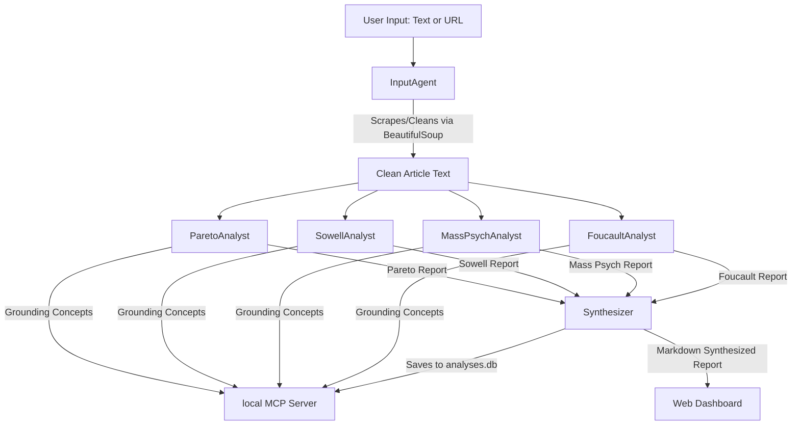

# 🏛️ Political Discourse Analyzer

An advanced multi-agent system built using the **Google ADK (Agent Development Kit)** and the **Model Context Protocol (MCP)**. This system analyzes political text, articles, or speeches from multiple classical sociological and philosophical lenses: Vilfredo Pareto, Thomas Sowell, Gustave Le Bon & Eric Hoffer (Mass Psychology), and Michel Foucault. 

It synthesizes these viewpoints into a cohesive, publication-grade analytical report, saved in a local SQLite database and rendered in a sleek, responsive dark-mode dashboard.

---

## 🌟 Overview & Problem Statement

In the digital age, political rhetoric is louder and more polarized than ever. Citizens, journalists, and researchers are bombarded with sophisticated persuasion tactics, cognitive biases, and ideological framing. Standard LLM summarizers capture *what* was said, but fail to analyze *how* it was framed, *why* certain rhetorical devices were chosen, and *what* underlying sociological structures are being activated.

The **Political Discourse Analyzer** solves this by decomposing rhetoric through four classical sociological and philosophical frameworks:
1. **Vilfredo Pareto's Theory of Residues and Derivations**: Deconstructs non-logical sentiments (Foxes vs. Lions) and intellectual justifications.
2. **Thomas Sowell's Political Visions**: Identifies whether the discourse operates under a *Constrained (Tragic) Vision* or an *Unconstrained (Utopian) Vision* of human nature.
3. **Gustave Le Bon & Eric Hoffer (Mass Crowd Psychology)**: Examines crowd triggers (simplification, repetition, contagion) and fanatical true-believer patterns.
4. **Michel Foucault's Power/Knowledge (Pouvoir-Savoir)**: Explores regimes of truth, disciplinary normalization, and biopolitical control.

---

## 🏗️ Architecture

The system uses a pipeline of specialized agents running sequentially to avoid LLM rate limits, ground their analyses using custom MCP tools, and store the output in a relational database.



### 🤖 Multi-Agent Pipeline (`app/agent.py`)
- **`InputAgent`**: Determines if the input is a URL. If so, it invokes a local scraping tool (`fetch_web_page`) to pull text, strip scripts/styles, and truncate text to prevent context windows explosion.
- **`ParetoAnalyst`**: Focuses on Pareto's theories. Grabs reference material from MCP, analyzes the text, and returns residues/derivations quotes.
- **`SowellAnalyst`**: Focuses on Sowell's conflict visions. Grabs definitions from MCP and evaluates human nature constraints.
- **`MassPsychAnalyst`**: Focuses on crowd suggestion and fanatical movements (Le Bon/Hoffer).
- **`FoucaultAnalyst`**: Analyzes the text for Power/Knowledge, Regimes of Truth, and Biopower.
- **`Synthesizer`**: Compiles all individual reports, generates a premium markdown report with a title, subtitle, and short executive summary, and writes it to SQLite using MCP.

### 🔌 Custom MCP Server (`app/mcp_server.py`)
Exposes tools to the pipeline:
1. `get_framework_definition`: Retrieves reference grounding texts for each sociologist/philosopher so agents analyze with high conceptual alignment.
2. `save_analysis_report`: Persists original text, individual specialist reports, final report, and executive summary to SQLite.
3. `list_analysis_reports`: Queries SQLite to retrieve all historical summaries.
4. `get_analysis_report`: Retrieves a specific report's full details and individual analyses.

---

## 🎓 Applied Key Concepts (Course Alignments)

As part of Kaggle's Capstone requirements, this project implements the following key agentic concepts:

| Course Concept | Implementation Details | Location in Code |
| :--- | :--- | :--- |
| **Agent / Multi-Agent System** | Six specialized agent roles organized as a `SequentialAgent` pipeline using the **Google ADK**. | [`app/agent.py`](file:///d:/political-discourse-analyzer/app/agent.py) |
| **MCP Server Integration** | Fully custom Model Context Protocol server exposing database storage and grounding definition retrieval tools. | [`app/mcp_server.py`](file:///d:/political-discourse-analyzer/app/mcp_server.py) |
| **Antigravity & Agents CLI** | Used for environment setup, interactive prototyping (`playground`), linting, and evaluation tracking. | [`GEMINI.md`](file:///d:/political-discourse-analyzer/GEMINI.md) |
| **Security Features** | Sanitizes web inputs using BeautifulSoup to strip `<script>`, `<style>`, `<header>`, and `<footer>` tags (preventing injection & noise), isolates API keys from codebase, and includes rate-limiting safety margins. | [`app/tools.py`](file:///d:/political-discourse-analyzer/app/tools.py) |
| **Deployability** | Containerized with a lightweight `Dockerfile`, pre-configured for GCP deployments, and integrated with OpenTelemetry. | [`Dockerfile`](file:///d:/political-discourse-analyzer/Dockerfile) |

---

## 🚀 Quick Start & Setup

### Prerequisites
- Python 3.11 or 3.12
- [uv](https://docs.astral.sh/uv/) installed (highly recommended Python package manager)
- Google GenAI/Vertex AI API Key

### Step 1: Clone and Install Dependencies
Install the `google-agents-cli` tool:
```bash
uv tool install google-agents-cli
```
Run the setup commands in the workspace root:
```bash
uvx google-agents-cli setup
agents-cli install
```

### Step 2: Configure Environment Variables
Create a `.env` file in the root directory:
```env
GEMINI_API_KEY=your_gemini_api_key_here
# If using Vertex AI instead of Google AI Studio, omit key and ensure gcloud credentials are set:
# GOOGLE_CLOUD_PROJECT=your_project_id
# GOOGLE_CLOUD_LOCATION=us-central1
```

### Step 3: Run the Web Dashboard
Start the local FastAPI development server:
```bash
uv run python app/web_server.py
```
Open [http://127.0.0.1:8000](http://127.0.0.1:8000) in your browser.

---

## 🧪 Testing and Evaluation

### Run Unit and Integration Tests
Execute tests to confirm agent validation, MCP tool call mechanics, and end-to-end dashboard routing:
```bash
uv run pytest tests/unit tests/integration
```

### Run Evaluation Scenarios
We leverage `agents-cli eval` to run golden dataset evaluations and analyze performance:
```bash
# Generate trace results from evaluation dataset
agents-cli eval generate

# Grade the results against predefined metrics
agents-cli eval grade
```

---

## 📂 Project Structure

```
political-discourse-analyzer/
├── app/
│   ├── agent.py          # Sequential multi-agent pipeline declaration
│   ├── tools.py          # Web fetching & sanitization tools
│   ├── mcp_client.py     # MCP toolset connection configuration
│   ├── mcp_server.py     # Custom SQLite and grounding reference MCP Server
│   ├── web_server.py     # FastAPI server providing the dashboard & history API
│   └── templates/
│       └── dashboard.html# Premium glassmorphic UI dashboard
├── tests/                # Test suite (unit, integration, and evals)
├── Dockerfile            # Container definition
├── pyproject.toml        # Dependencies and build settings
└── analyses.db           # SQLite database holding analytical results
```
